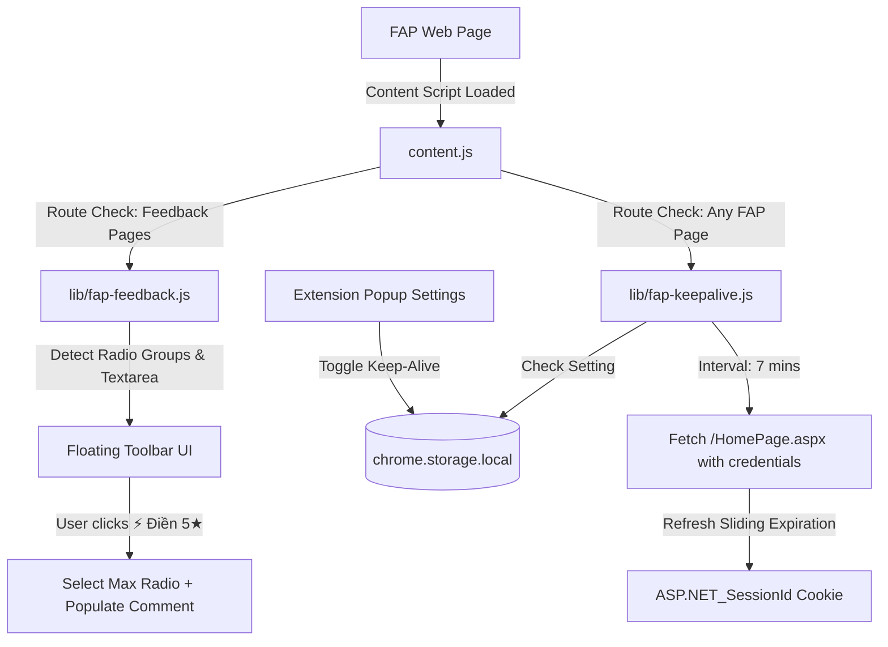

# Design Specification: FAP Survival Kit (Keep-Alive & 1-Click Survey Auto-Fill)

- **Date:** 2026-09-06
- **Status:** Draft (Approved in Brainstorming, Awaiting Final Review)
- **Target Release:** v3.7.0

## 1. Overview & Problem Statement

FPT University's Academic Portal (FAP - `fap.fpt.edu.vn`) is the central portal for students, but presents two major friction points:
1. **Aggressive Session Expiration:** FAP's ASP.NET WebForms session expires after 20 minutes of idle time. Students reviewing course materials, taking notes, or keeping the tab open in the background are abruptly logged out and redirected to `Default.aspx`, losing unsaved form states.
2. **Mandatory Lecturer Survey Wall:** At the end of each semester or midterm checkpoint, students are blocked from checking schedules, exam rooms, and grades until they complete mandatory feedback surveys for 4 to 6 course instructors. Each survey contains 10–20 radio questions and required comment fields.

The **FAP Survival Kit** solves both issues seamlessly within the existing Chrome Extension:
- **FAP Keep-Alive:** Lightweight heartbeat keeping the ASP.NET session active as long as at least one FAP tab is open.
- **1-Click Survey Auto-Fill:** Non-intrusive floating toolbar on FAP survey pages that auto-selects top ratings (5★) and populates polite, natural teacher appreciation comments in one click, leaving final submission in the student's control.

---

## 2. Architecture & Component Details

### 2.1 Component Diagram



### 2.2 Module: `lib/fap-keepalive.js`

- **Context:** Runs within content script on `*://fap.fpt.edu.vn/*`.
- **Preconditions:**
  - Page is not login/logout page (`/Default.aspx` or `/Logout.aspx`).
  - Setting `fapKeepSessionEnabled !== false` in `chrome.storage.local`.
- **Mechanism:**
  - Timer: `setInterval` running every 7 minutes (420,000 ms), well within ASP.NET's 20-minute sliding session window.
  - Request:
    ```javascript
    fetch('/HomePage.aspx', {
      method: 'GET',
      credentials: 'include',
      cache: 'no-store'
    })
    ```
  - Response Handling:
    - Status 200: Session refreshed successfully. Update local timestamp `fapLastKeepAlivePing = Date.now()`.
    - Status 302 or Redirected to `Default.aspx`: Session already expired on server; stop the interval to prevent pointless requests.
    - Errors (network offline): Silently ignore and retry on next interval.
- **Resource Efficiency:**
  - Runs in-tab; when all FAP tabs are closed, zero requests are sent.
  - Minimal bandwidth (~1 KB compressed header response), zero background service worker wakeups.

### 2.3 Module: `lib/fap-feedback.js`

- **Target Match:** `*://fap.fpt.edu.vn/Feedback/*`
- **DOM Detection & Selector Strategy:**
  - Detects if page contains survey form elements:
    - Radio groups: `input[type="radio"]` grouped by `name`.
    - Comment inputs: `textarea` element (e.g. `textarea[id*="txtComment"]`, `textarea[name*="Comment"]`, or the main feedback textarea).
  - Highest Rating Selection:
    - Within each radio group `name`, identify the radio corresponding to the highest rating (usually the highest numeric value attribute, or the last radio in standard left-to-right 1-to-4/5 scales).
    - Checks the selected radio and triggers `change` / `click` event so ASP.NET WebForms client scripts register the choice.
- **Comment Bank (Natural Student Appreciation):**
  - Includes a curated array of 12+ polite, authentic Vietnamese comments, for example:
    - *"Thầy/Cô dạy rất nhiệt tình, giải đáp thắc mắc của sinh viên rất chi tiết và tận tâm ạ."*
    - *"Bài giảng dễ hiểu, thầy/cô luôn tạo không khí học tập tích cực và truyền cảm hứng."*
    - *"Phương pháp giảng dạy rất hay và thực tế, em học hỏi được rất nhiều kiến thức bổ ích từ thầy/cô."*
    - *"Em rất cảm ơn thầy/cô đã đồng hành và hỗ trợ lớp nhiệt tình trong suốt học kỳ vừa qua ạ."*
  - Provides a `🎲 Đổi nhận xét` button to quickly cycle through comments.
- **Floating Toolbar UI:**
  - ID: `#fptu-feedback-toolbar`
  - Position: Fixed at top-right of page (`top: 20px; right: 24px; z-index: 999999`).
  - Styling: Modern dark glassmorphism (`backdrop-filter: blur(16px)`, rounded corners `14px`, border with subtle gradient glow, Outfit/Inter typography).
  - Actions:
    - `⚡ Điền 5★ & Khen ngợi`: Fills all criteria to max score + inserts comment.
    - `🎲 Đổi nhận xét`: Randomizes another comment.
    - `✕ Thu gọn`: Minimizes toolbar to a compact floating badge `⚡ Khảo sát nhanh`.
  - **Safety Gate:** No automated form submission. A toast reminds the student: *"Đã điền xong tất cả câu hỏi! Vui lòng kiểm tra lại và bấm nút 'Gửi ý kiến' bên dưới."*

### 2.4 Popup UI Updates (`popup.html` & `popup.js`)

- In the **Cài đặt** (Settings) tab of the extension:
  - Add a toggle switch:
    - Label: `Giữ phiên đăng nhập FAP (Keep Session)`
    - Subtext: `Tự động duy trì phiên FAP mỗi 7 phút khi có tab FAP đang mở để tránh bị đẩy về màn hình đăng nhập.`
    - Storage key: `fapKeepSessionEnabled` (default `true`).

---

## 3. Manifest Updates (`manifest.json`)

- Add `*://fap.fpt.edu.vn/*` or `*://fap.fpt.edu.vn/Feedback/*` to `content_scripts.matches`.
- Include `lib/fap-keepalive.js` and `lib/fap-feedback.js` in `content_scripts.js` (or import via `content.js`).

---

## 4. Error Handling & Edge Cases

| Scenario | Expected Behavior |
|---|---|
| User is not logged into FAP (on `Default.aspx`) | Keep-Alive does not initiate; Feedback toolbar does not appear. |
| User closes all FAP tabs | Heartbeat automatically stops; zero background network usage. |
| FAP changes radio input names | Fallback group selector: groups radios by parent table row `tr` or container element. |
| Survey has no textarea for comments | Auto-fill completes radio buttons gracefully without crashing. |
| Student disables Keep Session in settings | Next tab load reads `fapKeepSessionEnabled = false` and disables heartbeat. |

---

## 5. Testing & Verification Plan

### Automated Unit Tests (`tests/`)
1. **`tests/fap-keepalive.test.js`**:
   - Verify heartbeat intervals and calculation.
   - Verify skip condition on login URL (`/Default.aspx`).
   - Verify handling of 200 OK vs 302 redirect.
   - Verify toggle setting respects `fapKeepSessionEnabled`.
2. **`tests/fap-feedback.test.js`**:
   - Mock FAP survey HTML tables with multiple criteria rows and radio inputs.
   - Verify all questions are assigned top rating.
   - Verify textarea receives comment from sample bank.
   - Verify comment cycler picks unique phrases.
   - Verify toolbar minimize/expand toggles.

### Manual Verification
1. Open FAP in Chrome with extension loaded.
2. Verify Keep-Alive ping in Network tab every 7 minutes without user interaction.
3. Access a FAP survey page (`/Feedback/`), verify floating toolbar appears and fills 5★ with one click.
4. Verify extension bundle creates clean `fptu-schedule.zip` with 100% test pass rate.
